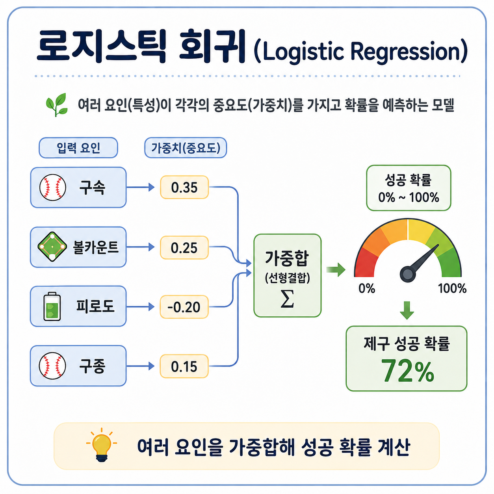

## 2. Logistic Regression

이 모델은 반드시 해보는 것을 추천합니다.

제구 성공확률을

P(제구성공)=σ(β0+β1X1+⋯+βpXp)P(\text{제구성공}) = \sigma(\beta_0 + \beta_1 X_1+\cdots+\beta_pX_p)

P(제구성공)=σ(β0+β1X1+⋯+βpXp)

처럼 표현합니다.

예를 들어 coefficient를 통해

- 구속 증가 → 제구 확률 감소
- 투구수 증가 → 제구 확률 감소
- 특정 볼카운트 → 성공 확률 증가

같은 방향성을 비교적 쉽게 확인할 수 있습니다.

하지만 중요한 약점은 **관계를 기본적으로 선형으로 가정한다는 것**입니다.

실제로는 구속과 제구가

> 135 → 140 → 145 km/h까지 별 차이가 없다가
> 
> 
> 148km/h 이상에서 급격히 제구율 감소
> 

같은 관계일 수 있습니다. Logistic Regression은 이런 패턴을 자동으로 찾는 데 한계가 있습니다.

따라서 필요하면 직접

- `velocity²`
- velocity × pitch_type
- fatigue × inning
- pitcher_hand × batter_hand

같은 interaction/비선형 변수를 추가합니다.

또한 숫자형 특성은 `StandardScaler`를 적용하는 편이 좋고, 범주형 변수는 일반적으로 One-hot encoding을 사용합니다. 전처리를 Pipeline 안에서 수행하면 train/test leakage도 방지하기 좋습니다.